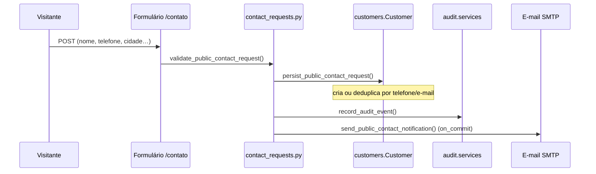

# Arquitetura — Granimármores Pitondo

Documento técnico da arquitetura **unificada atual**, confirmada no código em `config/`, `src/institutional/` e `hando/`.

## Monólito Django unificado

Existe **um único projeto Django executável**:

- Entrada: `manage.py` (raiz)
- Settings: `config.settings.development` (dev) / `config.settings.production` (prod)
- URLs: `config.urls`
- WSGI: `config.wsgi.application`

Site institucional, ERP Hando, Allauth e Django Admin compartilham:

- o mesmo processo WSGI/ASGI;
- o mesmo banco (`DATABASES["default"]`);
- o mesmo modelo de usuário (`AUTH_USER_MODEL = "users.User"`);
- o mesmo deploy.

## Relação entre `config/`, `src/institutional/` e `hando/`

```mermaid
flowchart TB
  subgraph root [Raiz do repositório]
    CFG[config/]
    MNG[manage.py]
    INST[src/institutional/]
    HANDO[hando/]
  end

  MNG --> CFG
  CFG -->|ROOT_URLCONF| URLS[config/urls.py]
  URLS -->|""| INST
  URLS -->|"/painel/"| HANDO
  CFG -->|INSTALLED_APPS| INST
  CFG -->|INSTALLED_APPS| HANDO
  CFG -->|sys.path.insert| HANDO
```

### `config/` (configuração principal)

- `config/settings/base.py` — apps, middleware, banco, estáticos, auth, e-mail
- `config/settings/development.py` — `DEBUG=True`
- `config/settings/production.py` — `DEBUG=False`
- `config/urls.py` — montagem de rotas públicas e ERP

> **`hando/config/` não é a configuração principal.** É resíduo do template Cookiecutter usado na origem do Hando. A execução oficial usa `config/` na raiz.

### `src/institutional/` (site público)

| Camada | Caminho | Responsabilidade |
|--------|---------|------------------|
| Presentation | `presentation/views.py`, `urls.py`, `sitemaps.py` | HTTP, rotas, sitemap |
| Application | `application/contact_requests.py` | Regras do formulário público |
| Infrastructure | `infrastructure/django/` | App Django (`InstitutionalConfig`), testes |

O `models.py` institucional está vazio; persistência de leads ocorre via **`customers.Customer`** (ERP).

### `hando/` (ERP)

Apps Django importados como pacotes Python:

- `core`, `accounts`, `access_control`, `audit`
- `customers`, `salespeople`, `materials`, `quotes`
- `assets`, `fleet`, `maintenance`
- `hando.users`, `hando.pages`

Templates do painel: `hando/hando/templates/`  
Estáticos do painel: `hando/hando/static/`

**O painel visual Hando comprado deve ser preservado.** Evoluções devem estender o template existente, não substituí-lo por layouts improvisados.

## Como `hando/` entra no Python path

Em `config/settings/base.py`:

```python
HANDO_DIR = BASE_DIR / "hando"
sys.path.insert(0, str(HANDO_DIR))
```

Isso permite `INSTALLED_APPS` referenciar `"quotes"`, `"materials"`, etc., e `"hando.users"` sem duplicar código.

## Banco compartilhado

```python
DATABASES = {
    "default": env.db(
        "DATABASE_URL",
        default=f"sqlite:///{BASE_DIR / 'db.sqlite3'}",
    )
}
```

- Desenvolvimento: SQLite em `db.sqlite3` (padrão) ou PostgreSQL via `.env`
- Produção: PostgreSQL recomendado (`psycopg` em `requirements/base.txt`)

Migrations de todos os apps (institucional + ERP) aplicam-se no **mesmo** banco.

## Usuário customizado

- Modelo: `users.User` (`hando/hando/users/models.py`)
- Autenticação: django-allauth em `/accounts/`
- Login redireciona para `pages:dashboard` → `/painel/`
- Registro público desabilitado por padrão (`ACCOUNT_ALLOW_REGISTRATION=False`)

Superusuários Django têm acesso total; usuários operacionais dependem de **RBAC** (`UserAccess` + `AccessRole`).

## Fluxo: visitante → formulário → cliente ERP → auditoria → e-mail

Implementado em `src/institutional/application/contact_requests.py`:



Validações incluem: campos obrigatórios, consentimento LGPD, honeypot (`website`), conflito telefone ≠ e-mail.

## Limites entre institucional e ERP

| Institucional | ERP |
|---------------|-----|
| Rotas em `/` | Rotas em `/painel/` |
| Templates `templates/institutional/` | Templates `hando/hando/templates/` |
| Conteúdo estático marketing | CRUD operacional |
| Captação (formulário) | Gestão (clientes, orçamentos, RBAC) |
| Sem login operacional próprio | Allauth + RBAC |

**Proibido** criar segundo painel administrativo paralelo. Novas áreas operacionais entram como módulos do Hando sob `/painel/`.

## Arquivos estáticos e mídia

| Setting | Valor |
|---------|-------|
| `STATIC_URL` | `/static/` |
| `STATICFILES_DIRS` | `static/`, `hando/hando/static/` |
| `STATIC_ROOT` | `staticfiles/` |
| `MEDIA_URL` | `/media/` |
| `MEDIA_ROOT` | `media/` |

Produção: `collectstatic` + WhiteNoise (`whitenoise.middleware.WhiteNoiseMiddleware`).

Em `DEBUG=True`, mídia local é servida via `config/urls.py`.

## Rotas públicas confirmadas

**13 rotas** em `src/institutional/presentation/urls.py` + **3 artigos** de blog (slugs em `views.py` e `sitemaps.py`) = **16 URLs** no sitemap.

Slugs de artigos:

- `escolher-pedra-bancada-cozinha`
- `marmore-ou-granito-diferencas`
- `cuidados-conservar-bancadas-pedra`

## SEO

- `/sitemap.xml` — implementado (`src/institutional/presentation/sitemaps.py`)
- `SITE_DOMAIN` — domínio canônico (padrão: `granimarmorespitondo.com.br`)
- `robots.txt` — **não encontrado no repositório** (a validar)

## Por que não criar outro projeto Django

1. **Duplicaria** banco, usuários, sessões e deploy.
2. **Quebraria** o fluxo formulário → `Customer` → orçamento ERP.
3. **Reintroduziria** painéis paralelos (decisão arquitetural explícita em `docs/DECISIONS.md`).
4. O `hando/manage.py` legado aponta para `config.settings.local` **dentro de `hando/config/`**, incompatível com a arquitetura unificada — **não usar**.

Alterações estruturais exigem auditoria de impacto e testes antes da implementação.
