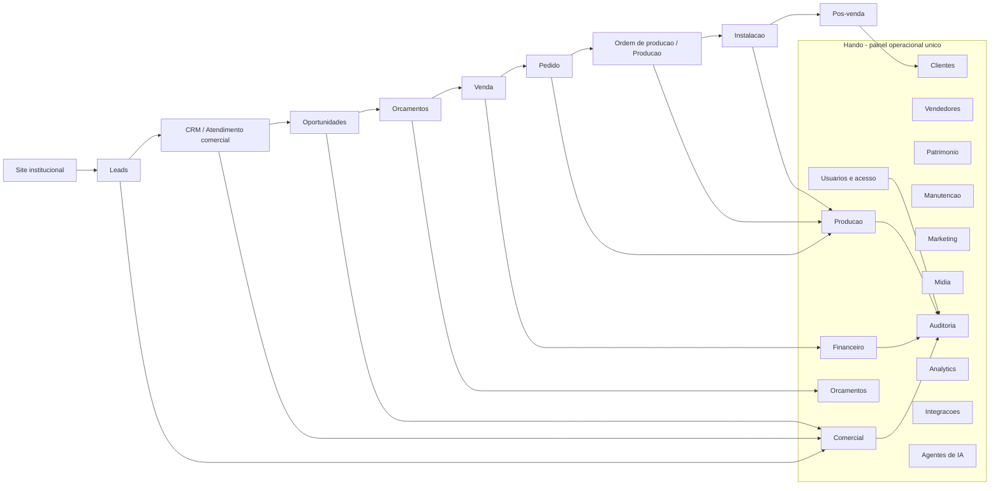

# Arquitetura e Diretrizes da Plataforma Granimarmores Pitondo

Este documento e referencia arquitetural obrigatoria para qualquer desenvolvimento futuro da plataforma Granimarmores Pitondo. Seu objetivo e evitar duplicacao de paineis, fluxos paralelos, usuarios, permissoes, orcamentos e fontes de verdade.

## 1. Objetivo da plataforma

A plataforma Granimarmores Pitondo deve unificar a operacao digital da empresa: presenca institucional, captacao de leads, atendimento comercial, CRM, orcamentos, venda, producao, instalacao, pos-venda, auditoria, indicadores e integracoes.

O sistema deve apoiar a jornada principal do negocio:

Origem do lead -> Lead -> Atendimento comercial -> Oportunidade -> Orcamento -> Venda -> Pedido -> Ordem de producao -> Producao -> Instalacao -> Pos-venda.

## 2. Principio central

A plataforma deve ter um unico painel administrativo para o usuario final.

O Hando e o painel administrativo oficial da Granimarmores Pitondo. Toda area operacional nova deve ser implementada como modulo do Hando, protegida pelo RBAC do Hando e integrada aos modelos centrais existentes.

E proibido criar novos backoffices, dashboards administrativos paralelos ou autenticacoes operacionais concorrentes.

## 3. Arquitetura de alto nivel

O site institucional e separado conceitualmente do painel administrativo, mas pertence a mesma plataforma de negocio. O site deve captar demanda; o painel Hando deve operar a demanda.

Arquitetura publica aprovada para a consolidacao atual:

- `/`: futuro site institucional.
- `/painel/`: painel administrativo Hando.

## 4. Dominios de negocio

### Usuarios e acesso

Responsabilidade: autenticacao operacional, usuarios, cargos, permissoes, escopos de dados, sessoes e segregacao de acesso.

Fonte de verdade: `hando.users.User`, `access_control.AccessRole`, `access_control.AccessPermission`, `access_control.RolePermission`, `access_control.UserAccess`.

Dependencias principais: Django auth, allauth, audit, views protegidas por decorators/helpers de permissao.

### Comercial

Responsabilidade: captar e qualificar leads, acompanhar atendimento, oportunidades, follow-ups, ranking, metas, score comercial e conversao em orcamento.

Fonte de verdade: deve ficar no Hando. Clientes, vendedores e orcamentos ja possuem models no Hando; Lead e Opportunity ainda devem ser incorporados ao Hando antes de voltarem a ser fonte operacional.

Dependencias principais: usuarios/acesso, vendedores, clientes, orcamentos, auditoria, integracoes de captacao.

### Clientes

Responsabilidade: cadastro unico de clientes, dados fiscais, contatos, enderecos e relacionamento comercial.

Fonte de verdade: `customers.Customer` e `customers.CustomerAddress`.

Dependencias principais: vendedores, orcamentos, auditoria, escopo de clientes no RBAC.

### Vendedores

Responsabilidade: cadastro unico de vendedores, vinculo opcional com usuario, hierarquia comercial, gestor e comissao.

Fonte de verdade: `salespeople.Salesperson`.

Dependencias principais: `hando.users.User`, clientes, orcamentos, escopos OWN/TEAM/DEPARTMENT/ALL.

### Orcamentos

Responsabilidade: proposta comercial, itens, medidas, acabamentos, servicos, versoes, politica comercial, aprovacao, envio e aceite.

Fonte de verdade: `quotes.Quote`, `quotes.QuoteItem`, `quotes.QuoteItemMeasurement`, `quotes.QuoteItemFinish`, `quotes.QuoteService`, `quotes.QuoteVersion`, `quotes.QuoteDelivery`, `quotes.CommercialPolicy` e `quotes.QuoteSequence`.

Dependencias principais: clientes, vendedores, materiais, acabamentos, servicos, usuarios, auditoria, permissoes comerciais.

### Financeiro

Responsabilidade: contas a pagar, contas a receber, caixa, pagamentos, conciliacao e relatorios financeiros.

Fonte de verdade: planejada. Nao ha dominio financeiro completo implementado no Hando no estado atual.

Dependencias principais previstas: vendas/pedidos, clientes, fornecedores, auditoria, permissoes financeiras restritas.

### Producao

Responsabilidade: pedidos aprovados, ordens de producao, medicoes, corte, acabamento, polimento, inspecao, fotos, observacoes tecnicas, entrega e instalacao.

Fonte de verdade: planejada. Nao ha dominio completo de pedido/producao/instalacao implementado no Hando no estado atual.

Dependencias principais previstas: orcamentos aceitos, clientes, materiais/chapas, usuarios, auditoria, midia.

### Patrimonio

Responsabilidade: maquinas, equipamentos, documentos, responsaveis, localizacao, status e manutencao relacionada.

Fonte de verdade: `assets.Asset`, `assets.AssetCategory`, `assets.AssetDocument`.

Dependencias principais: usuarios, manutencao, auditoria, escopo de patrimonio no RBAC.

### Manutencao

Responsabilidade: planos de manutencao, ordens de servico, custos de mao de obra/pecas/outros, anexos e conclusao.

Fonte de verdade: `maintenance.MaintenancePlan`, `maintenance.MaintenanceOrder`, `maintenance.MaintenancePart`, `maintenance.MaintenanceAttachment`.

Dependencias principais: ativos, veiculos, usuarios, auditoria, escopo de manutencao no RBAC.

### Marketing

Responsabilidade: campanhas, origem de leads, SEO, conteudo, performance de captacao, ranking de canais e inteligencia comercial.

Fonte de verdade: planejada. O site institucional existe como frente publica, mas marketing intelligence ainda deve ser modelado no Hando.

Dependencias principais previstas: leads, analytics, integracoes, agentes de IA, auditoria.

### Midia

Responsabilidade: biblioteca de imagens, fotos de obra, anexos comerciais, arquivos de producao, comprovantes e documentos.

Fonte de verdade: planejada no sistema para metadados. Arquivos podem ser armazenados em storage local ou externo, mas o estado operacional e metadados devem permanecer no ERP.

Dependencias principais previstas: clientes, orcamentos, pedidos, producao, manutencao, integracoes de armazenamento.

### Auditoria

Responsabilidade: registrar eventos relevantes, tentativas negadas, alteracoes de configuracao, aprovacoes, envios, cancelamentos, exportacoes e sessoes.

Fonte de verdade: `audit.AuditEvent` e `audit.UserSessionLog`.

Dependencias principais: todos os dominios operacionais e middleware/servicos de auditoria.

### Analytics

Responsabilidade: indicadores, dashboards, funil comercial, ranking de vendedores, produtividade, margens, SLAs e performance operacional.

Fonte de verdade: planejada como camada analitica sobre as entidades operacionais do Hando. Nao deve criar copia primaria de dados.

Dependencias principais previstas: leads, oportunidades, orcamentos, vendas, producao, financeiro, auditoria.

### Integracoes

Responsabilidade: conectar canais externos como WhatsApp, e-mail, Google Drive, ferramentas de analytics, formularios e automacoes.

Fonte de verdade: o Hando. Integracoes nao podem ser a fonte primaria de dados operacionais.

Dependencias principais previstas: usuarios, auditoria, permissoes, entidades centrais e metadados de sincronizacao.

### Agentes de IA

Responsabilidade: auxiliar atendimento, captacao, qualificacao, consulta contextual, sugestoes e automacoes supervisionadas.

Fonte de verdade: o Hando. Agentes nao devem criar entidades paralelas nem ignorar RBAC.

Dependencias principais previstas: usuarios, permissao, escopo, auditoria, contexto do registro afetado e integracoes.

## 5. Regra de painel unico

E proibido criar outro painel administrativo paralelo.

Toda nova area deve ser criada como modulo do Hando e protegida por RBAC. Separacao entre Diretoria, Comercial, Financeiro, Producao, Marketing, Administrativo, Patrimonio, Manutencao e Administracao do sistema deve acontecer por usuarios, cargos, permissoes e escopos de dados, nao por paineis separados.

O Django Admin pode existir como ferramenta tecnica, mas nao deve ser apresentado ao cliente como painel operacional.

## 6. RBAC

O RBAC do Hando e a autoridade de autorizacao operacional.

### User

`hando.users.User` e o usuario operacional unico do Hando. O projeto Hando usa `AUTH_USER_MODEL = "users.User"`.

### AccessRole

`AccessRole` representa cargos ou niveis de acesso. Campos relevantes:

- `name` e `slug`: identificacao do cargo.
- `hierarchy_level`: hierarquia; numero menor representa nivel mais alto.
- `is_system`: cargo estrutural do sistema.
- `is_active`: controla vigencia do cargo.
- `has_full_access`: concede acesso amplo dentro do painel.
- `customer_scope`, `quote_scope`, `asset_scope`, `maintenance_scope`: escopos por dominio.

### AccessPermission

`AccessPermission` representa permissoes atomicas por codigo, modulo e acao. Exemplos existentes incluem `dashboard.view`, `customers.view`, `quotes.approve`, `quotes.view_margin`, `materials.change_price`, `audit.view` e `settings.update`.

### RolePermission

`RolePermission` liga cargos a permissoes e indica se a permissao esta permitida para aquele cargo. A combinacao cargo/permissao deve ser unica.

### UserAccess

`UserAccess` liga um usuario a um cargo ativo, com vigencia e gestor opcional. Existe restricao para apenas um acesso ativo por usuario.

### Hierarquia e has_full_access

Superusuarios e cargos com `has_full_access` podem executar acoes amplas. Para gestao de cargos, `access_control.role_services.actor_can_manage_role` permite que um usuario gerencie apenas cargos abaixo do seu nivel hierarquico, salvo superuser ou `has_full_access`.

## 7. Escopos de dados

Escopos existentes em `DataScope`:

- `OWN`: usuario ve apenas registros sob sua responsabilidade direta.
- `TEAM`: usuario ve seus registros e registros da equipe vinculada.
- `DEPARTMENT`: usuario ve registros do departamento/area.
- `ALL`: usuario ve todos os registros do dominio autorizado.

Exemplos:

- Vendedor com `quote_scope=OWN`: ve seus proprios orcamentos.
- Gestor comercial com `quote_scope=TEAM`: ve orcamentos dos vendedores da equipe.
- Coordenador operacional com `maintenance_scope=DEPARTMENT`: ve ordens da area de manutencao.
- Diretoria com escopo `ALL`: ve indicadores e registros amplos, respeitando permissoes sensiveis como margem e custo.

Escopo nunca substitui permissao. Um usuario precisa da permissao correta e do escopo adequado.

## 8. Seguranca

Esconder menu nao e autorizacao.

Toda view, service ou endpoint que manipula dados operacionais deve validar permissao no backend. Tentativa de acesso por URL direta deve ser bloqueada quando o usuario nao possui permissao ou escopo.

Diretrizes obrigatorias:

- aplicar menor privilegio;
- separar funcoes sensiveis;
- validar autorizacao no backend;
- auditar tentativas relevantes;
- nao colocar regra de negocio apenas no template;
- nao expor custo, margem, financeiro ou administracao sem permissao explicita;
- nao confiar apenas em JS, CSS ou menu lateral.

## 9. Auditoria

Devem ser auditadas acoes operacionais relevantes, incluindo no minimo:

- login, logout e sessoes;
- tentativa negada de autorizacao relevante;
- criacao, alteracao, desativacao, reativacao e exclusao logica;
- aprovacao, rejeicao e cancelamento;
- envio de orcamento;
- exportacao, impressao ou download sensivel;
- alteracao de preco, custo, margem ou politica comercial;
- alteracao de cargo, permissao, escopo ou usuario;
- manutencoes concluidas;
- integracoes que alterem estado operacional;
- acoes de agentes de IA que consultem ou modifiquem dados operacionais.

Um evento deve registrar usuario, data/hora, acao, modulo, registro afetado, estado anterior e novo quando aplicavel, IP, sessao, user agent, metodo e rota quando houver request.

## 10. Fluxo comercial

Fluxo aprovado:

Lead -> Opportunity -> Quote -> Customer -> Sale/Order.

Na pratica, `Customer`, `Salesperson` e `Quote` ja possuem fonte de verdade no Hando. Lead e Opportunity devem ser incorporados ao Hando antes de voltarem a operar como entidades centrais.

Regras:

- lead captado pelo site, Livia ou integracao deve entrar no Hando;
- oportunidade deve referenciar lead/cliente e responsavel comercial;
- orcamento deve usar `quotes.Quote`, nao outro model concorrente;
- venda/pedido deve nascer de orcamento aceito ou aprovacao equivalente;
- ranking, score e metas devem usar dados operacionais do Hando.

## 11. Fluxo operacional

Fluxo alvo:

Venda -> Pedido -> Ordem de producao -> etapas -> inspecao -> entrega -> instalacao -> pos-venda.

Etapas previstas para producao:

- pedido aprovado;
- medicao;
- separacao de material/chapa;
- corte;
- acabamento;
- polimento;
- inspecao;
- embalagem/expedicao;
- instalacao;
- fotos e observacoes tecnicas;
- encerramento e pos-venda.

No estado atual, manutencao, patrimonio, frota, materiais e orcamentos ja existem parcialmente no Hando. Pedido/producao/instalacao ainda precisam ser modelados.

## 12. Financeiro

O dominio financeiro deve ser preparado para:

- contas a pagar;
- contas a receber;
- caixa;
- pagamentos;
- conciliacao;
- relatorios;
- permissao restrita a custos, margens e fluxo financeiro.

Nao implementar financeiro como painel separado. O financeiro deve ser modulo do Hando, com permissoes especificas, auditoria e integracao aos eventos de venda/pedido.

## 13. Diretrizes visuais do Hando

O Hando deve preservar sua identidade visual original:

- layout estrutural;
- sidebar;
- topbar;
- Feather icons e bibliotecas visuais existentes;
- tema light/dark;
- collapses;
- cards;
- tabelas;
- modais;
- responsividade;
- theme/customizer quando presente;
- padroes de componentes do template comprado.

O commit `4611dda` (`fix: finaliza identidade do usuario no topbar do ERP`) e marco historico visual/funcional aprovado do painel. Ele nao congela o produto, mas evolucoes visuais devem preservar a identidade do Hando e melhorar a partir dela.

Nao substituir o Hando por uma lista HTML simples, layout improvisado ou menu sem hierarquia.

## 14. Regras antes de criar novas entidades

Checklist obrigatorio antes de criar model, service, app, tabela, painel, autenticacao ou permissao:

1. Existe entidade equivalente no Hando?
2. A entidade atual pode ser estendida sem duplicar dominio?
3. Qual app e dono natural desse conceito?
4. Qual sera a fonte de verdade?
5. Quais permissoes sao necessarias?
6. Quais escopos se aplicam?
7. Quais acoes precisam de auditoria?
8. Existe impacto em cliente, vendedor, orcamento ou usuario?
9. Existe risco de criar fluxo paralelo?
10. A rota ficara dentro de `/painel/`?
11. A UI preserva o template Hando?
12. Os testes cobrem autorizacao, escopo e fluxo principal?

Se houver duplicidade, parar e rever arquitetura.

## 15. Anti-patterns proibidos

Sao proibidos:

- segundo painel administrativo;
- segundo sistema de RBAC;
- outro `User` operacional;
- outro `Quote` para o mesmo dominio;
- duplicar cliente;
- duplicar vendedor;
- ocultar menu sem proteger backend;
- colocar regra de negocio apenas no template;
- criar integracao como fonte principal de dados;
- alterar visual Hando sem necessidade;
- usar Django Admin como painel operacional do cliente;
- criar modulo financeiro, producao ou comercial fora do Hando;
- criar permissao visual sem verificacao no backend;
- registrar eventos relevantes sem auditoria.

## 16. Integracoes

Integracoes externas nao sao fonte primaria de verdade.

Exemplos:

- Livia capta e qualifica; o Hando registra.
- Google Drive armazena arquivos; o Hando mantem metadados, vinculos e estado operacional.
- WhatsApp comunica; o ERP mantem historico e status relevante.
- E-mail envia; o Hando registra entrega, erro e usuario responsavel.
- Ferramentas de analytics medem; o Hando preserva entidades centrais.

Toda integracao que alterar estado operacional deve respeitar RBAC, auditoria e contexto de usuario/sistema.

## 17. Diretrizes para IA/agentes

Agentes de IA nao podem:

- bypassar RBAC;
- gravar dados sem auditoria;
- criar entidades paralelas;
- operar sem contexto de usuario, permissao, escopo e registro afetado;
- expor dados financeiros, margens ou custos sem permissao;
- tomar decisao irreversivel sem regra explicita;
- tratar integracao externa como fonte primaria de verdade.

Acoes automatizadas devem ser rastreaveis, explicaveis e reversiveis quando o dominio exigir.

## 18. Roadmap macro

### Fase 1 - Presenca digital e captacao

Site institucional, SEO, canais de entrada, formularios, Livia, registros de origem e captacao.

### Fase 2 - CRM comercial

Leads, oportunidades, follow-ups, clientes, vendedores, score, ranking, metas, orcamentos, aprovacoes e envio.

### Fase 3 - Producao

Venda, pedido, ordem de producao, etapas produtivas, medicao, corte, acabamento, polimento, inspecao, instalacao e pos-venda.

### Fase 4 - Marketing intelligence

Analytics, origem de leads, campanhas, funil, conteudo, biblioteca de midia, relatorios de performance e assistentes de IA.

### Fase 5 - Escala

Integracoes maduras, automacoes, governanca, indicadores executivos, rotinas financeiras completas, auditoria expandida e processos multi-area.

## 19. Definition of Done arquitetural

Uma feature so esta concluida se:

- respeita painel unico;
- respeita RBAC;
- aplica autorizacao no backend;
- usa escopo de dados quando aplicavel;
- tem auditoria quando necessario;
- nao duplica dominio;
- nao cria fonte paralela de verdade;
- possui testes relevantes;
- mantem identidade visual do Hando;
- preserva rastreabilidade;
- atualiza documentacao quando altera arquitetura, dominio, permissao ou fluxo.

## 20. Processo obrigatorio antes de qualquer implementacao

Antes de implementar uma nova feature, o agente ou desenvolvedor deve responder:

1. Qual dominio?
2. Qual model existente representa isso?
3. Existe duplicidade?
4. Quais permissoes?
5. Qual escopo?
6. O que sera auditado?
7. Qual rota dentro do Hando?
8. Qual impacto no menu?
9. Quais testes?
10. Esta criando um segundo fluxo?

Se a resposta ao item 10 for SIM, parar e rever arquitetura.
